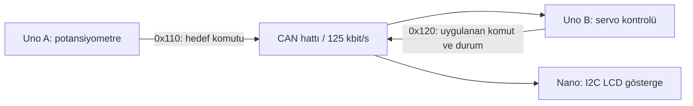

# Astrid CAN Lab

Arduino ve MCP2515 ile CAN haberleşmesini adım adım geliştiren gömülü sistem
laboratuvarı. Deneyler heartbeat takibinden üç düğümlü komut, aktüatör ve
gösterge ağına ilerler. Firmware Arduino C++ ile yazılmıştır.

## Üç düğümlü CAN ağı (EXP04)

Uno A analog girdiyi CAN çerçevesine dönüştürür. Uno B mesaj biçimini ve alive
counter ilerlemesini doğrulayarak servoya açı komutu uygular; kendi durumunu
ayrı CAN kimliğiyle yayınlar. Nano iki kaynağı bağımsız izleyip hedefi,
uygulanan komutu ve bağlantı durumunu 16x2 LCD'de gösterir.

## Deneyler

| Deney | İçerik | Kayıt durumu |
|---|---|---|
| [EXP01](docs/experiments/EXP01_CAN_Heartbeat_Timeout.md) | Heartbeat ve timeout | Firmware ve deney dokümanı mevcut |
| EXP02 | Alive counter, sayaç dondurma, servo bekleme konumu | [Gönderici](firmware/exp2/sender/sender.ino) ve [alıcı](firmware/exp2/receiver/receiver.ino) mevcut; deney dokümanı tamamlanacak |
| [EXP03](docs/experiments/EXP03_CAN_Potentiometer_Servo.md) | Potansiyometre ile CAN üzerinden servo kontrolü | Kullanıcı donanım denemesini tamamladı: 9 Eylül 2026 |
| [EXP04](docs/experiments/EXP04_Three_Node_CAN_Display.md) | Üç düğümlü ağ ve LCD durum takibi | Üç hedef derlendi; kullanıcı donanım başarısını bildirdi: 10 Eylül 2026 |
| [EXP05](docs/experiments/EXP05_CAN_Fault_Injection.md) | Butonla hata enjeksiyonu ve durum bazlı toparlanma | Üç hedef derlendi, otomatik test geçti; T01–T07 kullanıcı bildirimiyle başarılı: 10 Eylül 2026 |
| [EXP06](docs/experiments/EXP06_CAN_Priority_Load.md) | Trafik artırma, alıcı taşması, sıra penceresi ve toparlanma | Üç sketch derlendi, sıra takip testi geçti; donanım gözlemleri kaydedildi: 12 Eylül 2026 |

## Son deney: EXP06 trafik ve alıcı taşması

İki Uno farklı CAN kimlikleriyle artan hızda mesaj gönderir; Nano mesajları,
geç gelen sıra numaralarını ve MCP2515 taşma bayraklarını izler. Alıcıyı
butonla yavaşlatma ve ardından toparlanma, seri monitör görüntülerinde gözlendi.
32 numaralık sıra penceresi, pencere içinde geç gelen mesajları kayıp saymaz.
Arbitration doğrudan ölçülmedi; mesaj sayıları kesin hat doluluk oranı değildir.

[EXP06 kurulum ve sonuçlar](docs/experiments/EXP06_CAN_Priority_Load.md) ·
[Kodlar](firmware/exp6) · [Otomatik sıra takip testi](tests/exp06_sequence_test.cpp)

## EXP05 hata enjeksiyonu

Üç butonla sayaç donması, geçersiz ADC ve komut yayınının kesilmesi üretilir.
Aktüatör hata nedenini CAN üzerinden yayınlar; Nano LCD'de gösterir. Hata
halinde 90° komutu uygulanır, normal yayına dönülünce doğrulama sonrası
kontrol geri gelir. EXP05 farklı kimlikler kullanır: komut 0x130, durum 0x140.

[EXP05 bağlantı, protokol ve test sonuçları](docs/experiments/EXP05_CAN_Fault_Injection.md)
üç kartın kodlarına giden yolları içerir. Göndericiye D2/D3/D4 ile GND arasına
üç buton eklenir. Kullanıcı buton ve toparlanma denemelerinin geçtiğini bildirdi.
Ayrıca [otomatik durum mantığı testi](tests/exp05_monitor_test.cpp) sayaç/zaman
taşmasını, hata sürekliliğini, timeout sınırını ve toparlanmayı kontrol eder.

## EXP04'ü çalıştırma

Gerekli donanım: iki klasik 5V Uno, bir klasik 5V Nano (ATmega328P), üç MCP2515
ve CAN transceiver modülü, 10k potansiyometre, SG90 servo, uygun 5V servo
beslemesi, I2C arkalıklı 16x2 LCD ve LED/direnç.

1. [Bağlantı ve test rehberini](docs/experiments/EXP04_Three_Node_CAN_Display.md)
   takip et. CAN hattının yalnız iki fiziksel ucunda 120 ohm sonlandırma kullan.
2. Arduino IDE'ye [autowp MCP2515](https://github.com/autowp/arduino-mcp2515),
   Arduino Servo ve [hd44780](https://github.com/duinoWitchery/hd44780) kütüphanelerini kur.
3. [Göndericiyi](firmware/exp4/sender/sender.ino) Uno A'ya,
   [aktüatörü](firmware/exp4/receiver/receiver.ino) Uno B'ye,
   [göstergeyi](firmware/exp4/display/display.ino) Nano'ya yükle.
4. Seri monitörü 115200 baud aç. Potu çevirerek servo komutunu ve LCD'yi izle;
   ardından rehberdeki bağlantı kesilmesi senaryolarını uygula.

Kod 125 kbit/s CAN ve 8 MHz MCP2515 kristaline ayarlıdır. Kristali her modülde
kontrol et ve gerektiğinde ilgili sketch'teki saat ayarını değiştir.

## Teknik kapsam ve doğrulama

- SPI üzerinden MCP2515 erişimi, analog girdi ve I2C ekran kullanımı.
- Standart CAN kimlikleri, bayt düzeyinde paketleme ve bağımsız mesaj sayaçları.
- DLC, işaret baytı ve veri aralığı kontrolü; üç doğru sayaç adımıyla toparlanma.
- EXP03/04'te 500 ms ilerleme timeout'u ve hata halinde 90° servo komutu.
- EXP04/05 için Arduino AVR 1.8.7 ile Uno/Uno/Nano derlemesi başarılı.
- EXP05’te çerçeve yokluğu timeout’u, ayrı sayaç/veri hataları ve otomatik durum testi.

Donanım başarı kayıtları projeyi kuran kullanıcının bildirimlerine dayanır;
EXP06 için ekran görüntülerinden seçili seri satırlar dokümana aktarıldı;
kesintisiz log dosyaları henüz eklenmedi. LCD'deki açı
gerçek mil açısının ölçümü değil, yazılımın servoya verdiği komuttur.
90° konumu enerji kesme sağlamaz. Bu bir masaüstü öğrenme prototipidir;
otomatik bus-off toparlanması ve gerçek araç üzerinde doğrulama kapsamda değildir.

## Sıradaki iyileştirmeler

- Kurulum fotoğrafı, kısa çalışma videosu ve seri monitör kayıtları eklemek.
- EXP02 bağlantı/protokol ve test dokümanını tamamlamak.
- Kütüphane sürümlerini sabitleyip otomatik derleme kontrolü eklemek.
- Sayaç donması, taşma, geçersiz paket ve yeniden bağlantı sonuçlarını ayrı kaydetmek.
